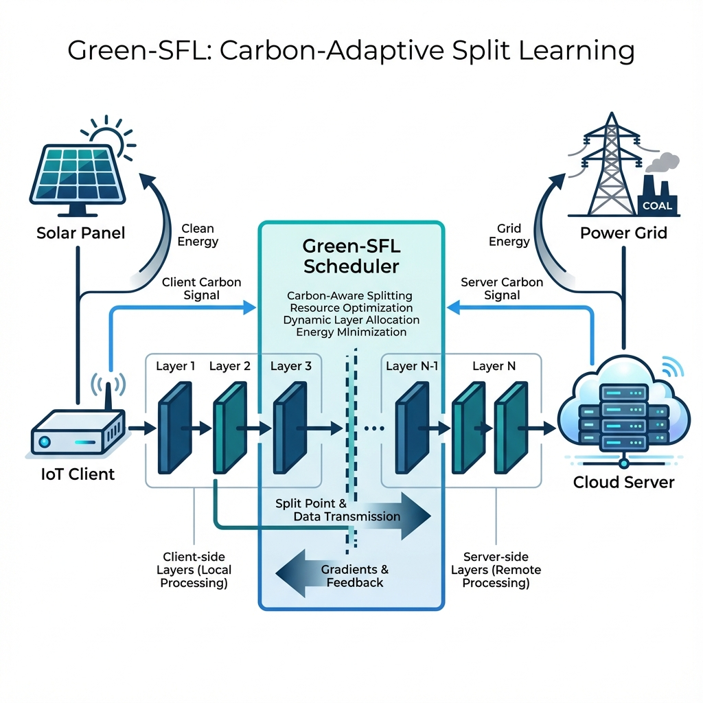

# Green-SFL: Carbon-Aware Dynamic Split Federated Learning

[](https://opensource.org/licenses/MIT)
[](https://doi.org/10.5281/zenodo.0000000)
[](https://www.python.org/downloads/)

Official reference implementation for the paper:
> **Green-SFL: A Carbon-Aware Dynamic Split Federated Learning Framework for Sustainable IoT**  
> *Umer Tanveer*  
> *Frontiers in Communications and Networks (2026)*

---

## 📌 Abstract

Split Federated Learning (SFL) is a promising paradigm for resource-constrained IoT, but existing frameworks optimize primarily for latency, often ignoring the carbon intensity of the energy source. **Green-SFL** fundamentally redefines this objective by treating **Grid Carbon Intensity ($gCO_2/kWh$)** as a first-class constraint. 

This repository contains the discrete-event simulation framework used to validate Green-SFL. It integrates:
1.  **Authentic Carbon Traces**: Real-time data from CAISO and National Grid ESO.
2.  **Real-World IoT Traffic**: Network features from the CICIoT 2023 dataset.
3.  **Convex Optimization**: A "Solar-Aware" scheduler that dynamically partitions Neural Networks (NNs) to minimize the aggregate carbon footprint.

## ⚙️ Methodology

The core innovation of Green-SFL is its **Carbon-Adaptive Split Scheduler**. Unlike static approaches, our framework continuously monitors the carbon differential between the Edge (IoT Device) and the Cloud (Server).

### System Architecture


The system operates in three phases:
1.  **Profiler**: Measures the FLOPs and Activation size of each layer $l$ in the Neural Network.
2.  **Carbon Oracle**: Fetches real-time carbon intensity $I(t)$ from regional grid APIs (CAISO/National Grid).
3.  **Optimizer**: Solves the following cost function at each time step $t$:

$$ \min_{s \in \mathcal{S}} \mathcal{J}(s, t) = \alpha \underbrace{\left[ E_{\text{client}}(s) \cdot I_{\text{client}}(t) + E_{\text{server}}(s) \cdot I_{\text{server}}(t) \right]}_{\text{Carbon Footprint}} + \beta \underbrace{\left[ T_{\text{compute}}(s) + T_{\text{comm}}(s) \right]}_{\text{Latency}} $$

**Key Behavior**:
- **Solar Window (Noon)**: When solar energy is abundant at the edge ($I_{\text{client}} \approx 0$), the system keeps more layers on the device.
- **Carbon Peak (Evening)**: When the grid gets dirty, the system offloads computation to a cleaner data center or defers training.

## 📂 Repository Structure

```tree
Green-SFL-Official/
├── main.py                 # Primary simulation engine and visualization driver
├── profiler.py             # Layer-wise energy & latency profiler (Jetson/Pi specs)
├── real_data_loader.py     # Interface for CAISO/National Grid carbon traces
├── models.py               # 1D-CNN Architecture definition (PyTorch)
├── green_sfl_methodology_pro.png # System Architecture Diagram
├── data/
│   ├── ciciot2023_sample.csv           # Benign/Attack traffic samples
│   └── carbon_intensity_2024.csv       # 5-minute interval grid data
├── CITATION.cff            # Research citation metadata
├── LICENSE                 # MIT License
└── requirements.txt        # Reproducibility dependencies
```

## 🚀 Reproducibility

To reproduce the figures presented in the paper (Fig 1-6), follow these steps:

### 1. Environment Setup

We recommend using a virtual environment regarding dependencies:

```bash
# Create and activate environment
python -m venv venv
source venv/bin/activate  # On Windows: venv\Scripts\activate

# Install dependencies
pip install -r requirements.txt
```

### 2. Run Simulation

Execute the main driver script. This will run the optimization loop over a 24-hour horizon and generate the artifacts.

```bash
python main.py
```

### 3. Generated Artifacts

The script will output the following high-resolution figures:
- `fig1_carbon_traces.png`: Visualization of the Carbon Intensity Duck Curve.
- `fig2_banana_tradeoff.png`: The "Banana Plot" showing the Pareto frontier.
- `fig3_schedule_heatmap.png`: The resulting optimal splitting schedule.
- `fig4_cumulative_savings.png`: Cumulative carbon reduction vs. baseline.

## 📝 Citation

If you utilize this codebase or methodology in your research, please associate it with the following citation:

```bibtex
@article{tanveer2026greensfl,
  title={Green-SFL: A Carbon-Aware Dynamic Split Federated Learning Framework for Sustainable IoT},
  author={Tanveer, Umer},
  journal={Frontiers in Communications and Networks},
  year={2026},
  publisher={Frontiers}
}
```

## 📄 License

This project is open-sourced under the **MIT License**. See `LICENSE` for details.

---
*Developed by Umer Tanveer, Department of Computer Science.*
